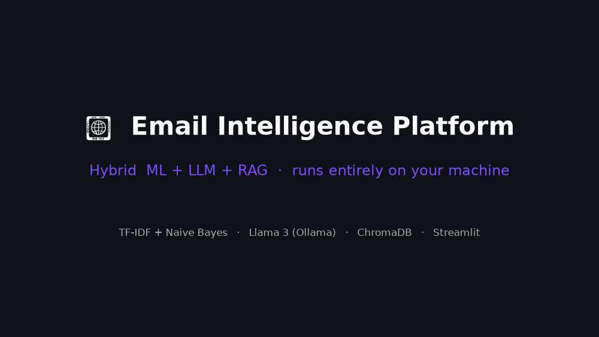
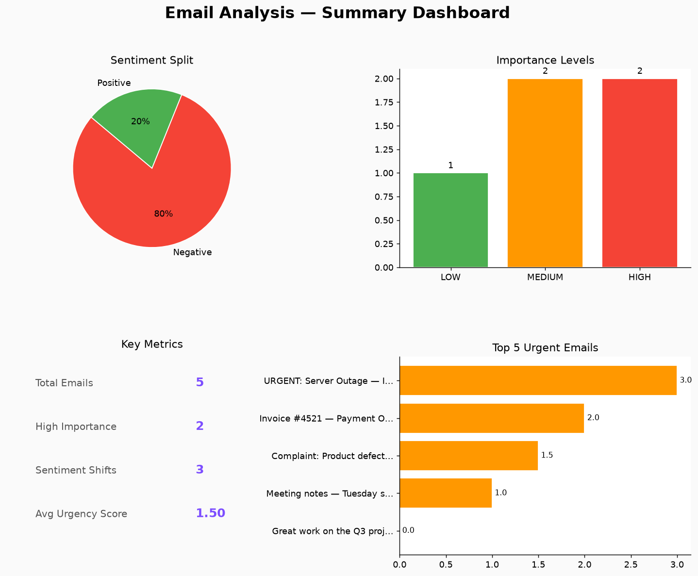
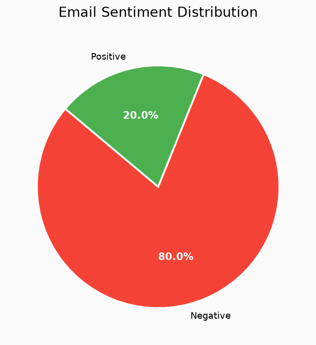
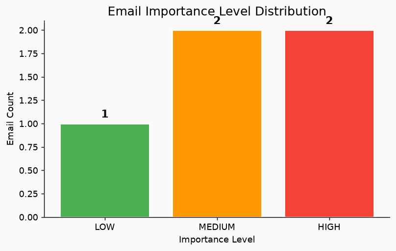
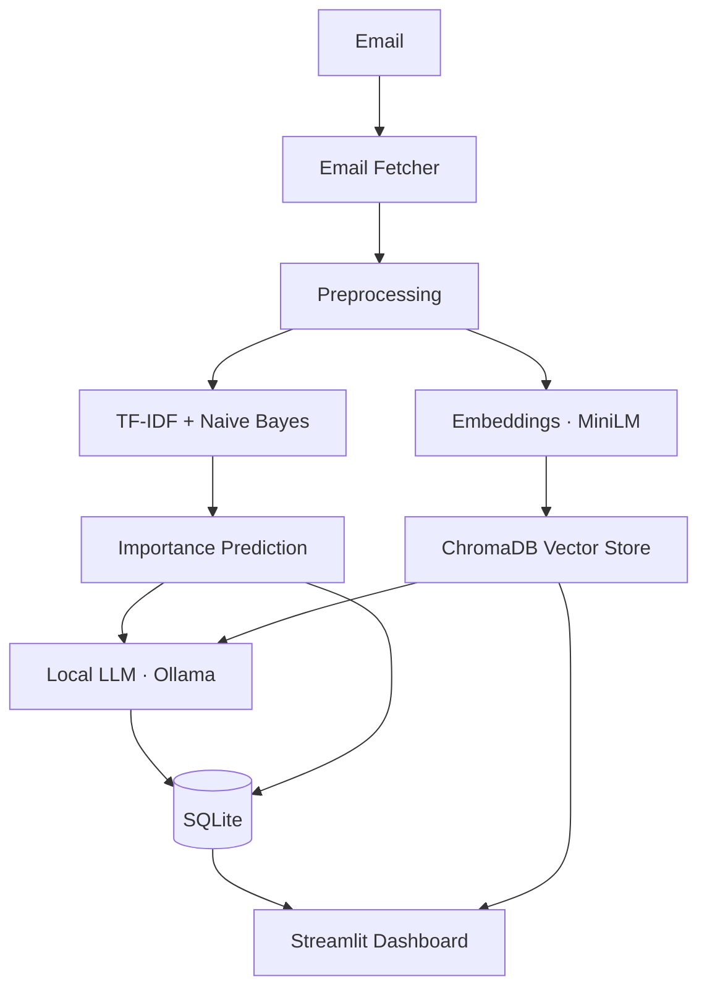

# Email Intelligence Platform

A local-first **Hybrid ML + LLM + RAG** platform for understanding email.

It keeps the original, fast **TF-IDF + Naive Bayes** sentiment/importance pipeline
intact and **adds an intelligence layer on top**: a local LLM (via Ollama) for
summaries, action items, deadlines, replies, categorization, entity extraction,
risk detection, and ML-prediction explanations — plus **Retrieval-Augmented
Generation** (Sentence-Transformers + ChromaDB) for semantic search and a
"Chat with your emails" assistant.



> **Local-only. No cloud APIs.** No OpenAI / Anthropic / Gemini. The LLM runs on
> your machine through [Ollama](https://ollama.com). Every AI feature degrades
> gracefully — if Ollama or the AI packages aren't installed, the original ML
> pipeline keeps working exactly as before.

---

## Screenshots

| Summary dashboard | Sentiment | Importance |
|---|---|---|
|  |  |  |

> _Charts auto-generated by the analytics module. The Streamlit dashboard adds
> AI Summary, Chat with Emails, Semantic Search, Risk, and more._

---

## Architecture



Text view of the pipeline:

```
Email → Fetcher → Preprocessing ─┬─► TF-IDF + Naive Bayes ─► Importance ─┐
                                 │                                        ├─► Local LLM (Ollama)
                                 └─► Embeddings (MiniLM) ─► ChromaDB ──────┘         │
                                                                                    ▼
                                                          SQLite ◄───────────── results + cache
                                                             │
                                                             ▼
                                                   Streamlit Dashboard / CLI
```

### Layered design (clean architecture)

```
config.py                      ← single source of truth (stdlib-only, .env aware)
src/
  nlp_model.py                 ← TF-IDF + Naive Bayes  (ORIGINAL, unchanged behavior)
  sentence_analyzer.py         ← sentence-level sentiment + shift detection
  importance_predictor.py      ← 5-factor importance score
  sentiment_analyzer.py        ← original orchestrator
  email_fetcher.py             ← Gmail IMAP
  analytics.py                 ← matplotlib charts + text report
  database.py                  ← SQLite (extended with 4 new tables)
  rag/
    embeddings.py              ← Sentence-Transformers provider (lazy, graceful)
    vector_store.py            ← ChromaDB wrapper (lazy, graceful)
  llm/
    ollama_client.py           ← local LLM client over stdlib HTTP (graceful)
    prompts.py                 ← prompt templates for every feature
  services/
    rag_service.py             ← embed + dedup + semantic search
    llm_service.py             ← the 8 LLM features, cached
    chat_service.py            ← RAG-grounded chat + conversation memory
  ui/
    services.py, components.py ← Streamlit helpers (cached factory, widgets)
app.py + pages/                ← Streamlit dashboard (7 pages)
scripts/                       ← train, analytics, backfill embeddings, chat REPL
tests/                         ← unit tests (ML, RAG, LLM, chat, database)
```

**Why it's hybrid, not a rewrite:** the LLM never replaces the ML model. For
example, the "Explain ML prediction" feature *consumes* the existing
`ImportancePredictor` score breakdown and asks the LLM to explain it.

---

## Quick start

```bash
./setup.sh          # install deps, NLTK data, train model, pull LLM (optional)
./run.sh ui         # launch the Streamlit dashboard

# other entry points
./run.sh cli        # original interactive CLI (python main.py)
./run.sh chat       # chat-with-emails REPL
./run.sh index      # backfill embeddings for search/chat
./run.sh test       # run the test suite
```

### Manual setup

```bash
pip install -r requirements.txt          # or: conda env create -f environment.yml
cp .env.example .env                      # optional config
python scripts/train_model.py            # train the ML model
streamlit run app.py                      # dashboard
```

### Enabling the AI features

```bash
# 1. Install Ollama → https://ollama.com
ollama serve
ollama pull llama3                        # or gemma3 / mistral

# 2. Index your emails for semantic search & chat
python scripts/backfill_embeddings.py
```

### Using it on your real inbox

```bash
# Create a Gmail App Password (Google Account → Security → App Passwords),
# then add it to .env:
GMAIL_EMAIL=you@gmail.com
GMAIL_APP_PASSWORD=xxxxxxxxxxxxxxxx
```

Then either use the **📥 Fetch Emails** page in the dashboard, or the CLI
(`./run.sh cli` → option 1). Fetched emails run through the ML pipeline, are
stored, and can be indexed for search/chat — all locally.

### Model quality note

The bundled `data/train_data.csv` is a 50-row toy set (the neutral class never
learns). For sensible results, retrain on more data:

```bash
python scripts/generate_dataset.py                       # balanced synthetic set
python scripts/train_model.py --data data/train_data_large.csv
# — or point at your own labeled CSV (columns: text,label) —
python scripts/train_model.py --data path/to/real_emails.csv
```

The LLM features (summary, actions, risk, chat) don't depend on this model —
they use the local LLM directly.

---

## Configuration

All settings live in **`config.py`** and can be overridden via environment
variables or a `.env` file (see `.env.example`). Key values:

| Variable | Default | Meaning |
|---|---|---|
| `LLM_MODEL` | `llama3` | Local model (`llama3` \| `gemma3` \| `mistral`) |
| `OLLAMA_BASE_URL` | `http://localhost:11434` | Ollama daemon URL |
| `LLM_ENABLED` | `true` | Master switch for LLM features |
| `EMBEDDING_MODEL` | `all-MiniLM-L6-v2` | Sentence-Transformers model |
| `CHROMA_DIR` | `db/chroma` | Vector store location |
| `RAG_TOP_K` | `5` | Neighbours retrieved per query |

```python
import config
print(config.LLM_MODEL)   # "llama3"
```

---

## Features

### Preserved from the original system
- Gmail IMAP fetching, preprocessing, real-time inbox monitoring
- **TF-IDF + Multinomial Naive Bayes** sentiment classification
- Sentence-level sentiment + **shift detection**
- **5-factor importance** scoring (LOW / MEDIUM / HIGH)
- SQLite persistence, matplotlib analytics dashboard, large-dataset training

### New AI layer (LLM)
1. **AI Summary** — concise email summaries
2. **Action Item Extraction** — concrete tasks
3. **Deadline Detection** — today / tomorrow / 5 PM / 31 July …
4. **Suggested Reply** — professional drafts
5. **Email Categorization** — Support, Finance, HR, Meeting, Invoice, Marketing, Legal, Security, Spam, General
6. **Named Entity Extraction** — people, companies, dates, products, locations
7. **Risk Detection** — priority / escalation / security / legal / financial
8. **Explain ML Prediction** — the LLM explains *why* the ML rated importance as it did

### New AI layer (RAG)
- **Semantic Search** — find emails by meaning (e.g. "overdue invoices")
- **Chat with Emails** — grounded Q&A: "Which emails mention Kubernetes?",
  "What invoices are pending?", "What did Microsoft ask last week?"

### Dashboard pages
Home · Fetch Emails · AI Summary · Chat with Emails · Semantic Search · Action Items ·
Important Emails · Risk Dashboard · LLM Settings

---

## Database

SQLite (`db/email_analysis.db`). The runtime DDL in `src/database.py` is the
single source of truth; `db/schema.sql` mirrors it.

| Table | Purpose |
|---|---|
| `emails` | one row per analysed email (original) |
| `email_sentences` | sentence-level sentiment (original) |
| `email_embeddings` | RAG embedding tracking + content hash (Phase 1) |
| `llm_analysis` | cached LLM feature outputs (Phase 2) |
| `chat_history` | chat turns (Phase 3) |
| `conversation_memory` | rolling chat summaries (Phase 3) |

Existing tables and behavior are unchanged — new tables only *extend* the schema.

---

## Performance & resilience

- **Embedding cache** — emails are re-embedded only when their content hash
  changes; backfill uses a single batched encode.
- **LLM cache** — every feature result is cached in `llm_analysis` keyed by
  `hash(feature + model + input)`, so the LLM is never called twice for the same
  input.
- **Graceful degradation** — missing Ollama, an un-pulled model, missing AI
  packages, embedding/DB/network errors all produce clear "unavailable" states
  rather than crashes.

---

## Testing

```bash
./run.sh test                 # or: python tests/run_tests.py
python -m unittest tests.test_rag -v
```

| Suite | Covers |
|---|---|
| `tests/test_all.py` | ML preprocessing/model, importance, sentence split, database |
| `tests/test_rag.py` | embedding dedup, batch backfill, semantic search, degradation |
| `tests/test_llm.py` | all 8 LLM features, caching, output validation, degradation |
| `tests/test_chat.py` | RAG-grounded chat, history, memory, sources, degradation |

The LLM/RAG suites use fakes, so they run **without** the AI stack or a daemon.
ML tests auto-skip when scikit-learn isn't installed.

---

## Requirements

- Python 3.9–3.12 (3.11 recommended for AI wheels)
- Core: scikit-learn, numpy, pandas, nltk, matplotlib
- AI (optional): sentence-transformers, chromadb, streamlit, + a running Ollama daemon
